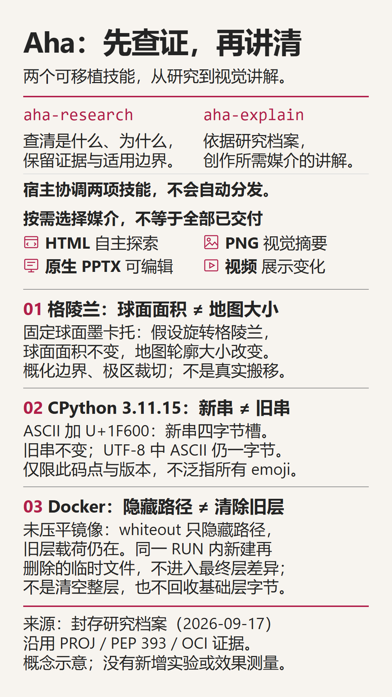

# Aha! · 原来如此

**Investigate a complex question. Turn the understanding into an explanation worth seeing.**

[English](README.md) | [简体中文](README.zh-CN.md) · [Install](docs/INSTALL.md) · [Documentation](docs/README.md) · [Examples](examples/README.md)

Aha is two portable agent skills for public topics, provided materials, and authorized codebases. Research is an independent deliverable; visual explanations are authored for their medium, not poured into one slide template.

| Skill | What it does | Delivers |
| --- | --- | --- |
| `aha-research` | Breaks down questions, gathers evidence, checks competing explanations, and follows up on gaps | A readable report and an independent, source-linked Research Dossier |
| `aha-explain` | Researches as needed, designs the explanation, authors source, and renders and reviews the requested medium | Rich HTML with diagrams/interactions, PNG infographics, native editable PPTX, or narrated dynamic video |

<p align="center">
  
</p>

## See what it makes

Start with the [Aha introduction](examples/aha-introduction/README.md): [bilingual HTML](examples/aha-introduction/index.html), an [8-slide Chinese native PPTX](examples/aha-introduction/overview.pptx), a [Chinese infographic](examples/aha-introduction/overview.png), or the existing [1:59 English video](examples/aha-introduction/overview-v5.mp4). This is the primary project introduction, based on its September 17 research snapshot. Explore the [Greenland](examples/greenland/README.md), [CPython strings](examples/cpython-string/README.md), and [Docker image layers](examples/docker-layers/README.md) examples separately. Topic guides record sources, editable projects, outputs, and review limits.

The [full gallery](examples/README.md) also includes noise cancellation and Git merge. Aha introduction is the only project tour. Preserved examples are snapshots, not promises about the current runtime. A successful render or short preview is not a substitute for complete visual and listening review.

## Install, then ask naturally

Download a complete package from [GitHub Releases](https://github.com/sawyer0x110/aha/releases) and follow [Install](docs/INSTALL.md) ([中文](docs/INSTALL.zh-CN.md)). Requires **Node.js 22+**; recipients do **not** need `npm install`. Install project-locally in `.agents\skills`, then separately confirm your agent can discover and run both skills. The source `skills` directory is not an installable package.

> Investigate the conflicting explanations in these two documents. Give me a source-grounded report and an independent research archive, including uncertainty and missing evidence. Use only the provided materials; do not go online or make visuals.

> Turn that research archive into an offline HTML explanation with diagrams, sources, and limitations. Create HTML only, and do not execute page scripts.

A safe local runtime check after installation (replace the project path):

```powershell
node "C:\your-project\.agents\skills\aha-explain\scripts\aha.mjs" doctor
```

This checks runtime integrity, not host discovery, factual accuracy, or optional media readiness. See the [usage guide](docs/USAGE.md) ([中文](docs/USAGE.zh-CN.md)) for the full CLI workflow.

## Deliberate defaults, explicit limits

- **Only the requested medium.** Visual requests with no clear format default to HTML; ordinary text answers and research-only requests do not. Multiple formats require an explicit request and separate authoring.
- **Language is a choice.** New HTML defaults to bilingual English/Chinese, initially English. PNG, PPTX, and video default to English; request Chinese explicitly. Research language is independent.
- **Research and artwork stay independent.** Version-bound evidence is not rewritten to fit a layout. New outputs do not overwrite old files; source, receipts, and review limits remain traceable.
- **Permissions are separate.** No automatic software installs, browser downloads, or public uploads. Executing authored code requires approval and is **not sandboxed**. Online narration requires approval of the exact plan and external processing.
- **Tools check structure, not truth.** The host agent performs the research and design. The CLI does not search the web or execute the studied repository. Source review, native PPTX inspection, and full-video review still matter.
- **Platform and host support are bounded.** Windows has been exercised. macOS/Linux are not claimed verified; POSIX examples are path guidance, not a support guarantee. Installer cases for Copilot/Codex are not proof of live host discovery or natural-language routing.

Source/package runtime: **0.3.2**. Research/artifact schemas: **1.0.0**. Version 0.3.2 includes MIT notices and bilingual package guides; published `v0.3.1` assets remain unchanged. Confirm publication and use the assets actually attached to your selected [release](https://github.com/sawyer0x110/aha/releases), not a source version alone.

## Documentation and contribution

| Start here | Deeper reference |
| --- | --- |
| [Install](docs/INSTALL.md) / [安装](docs/INSTALL.zh-CN.md) | [Product requirements](docs/PRD.md) (Chinese) |
| [Usage and CLI workflow](docs/USAGE.md) / [使用指南](docs/USAGE.zh-CN.md) | [Architecture and directory map](docs/ARCHITECTURE.md) (Chinese) |
| [Contributing](.github/CONTRIBUTING.md) / [参与贡献](.github/CONTRIBUTING.zh-CN.md) | [Research protocol](docs/RESEARCH.md) (Chinese) |
| [Security](.github/SECURITY.md) / [安全政策](.github/SECURITY.zh-CN.md) | [Evaluation protocol](docs/EVALUATION.md) (Chinese) |

Original project code and documentation are licensed under [MIT](LICENSE). Read [License scope](docs/LICENSE-SCOPE.md) for third-party dependencies, cited material, and preserved examples; inclusion is not a blanket relicensing of outside material. The [documentation index](docs/README.md) separates current guides, Chinese advanced references, and preserved evidence.
