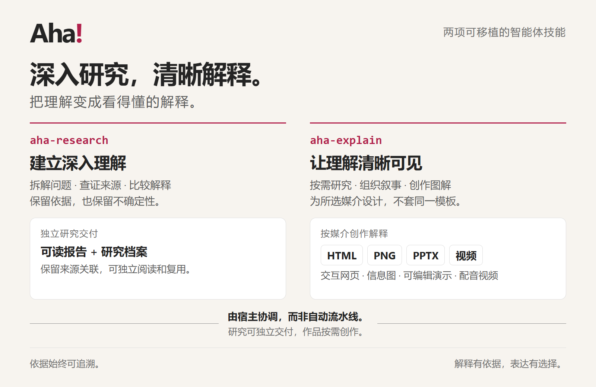

# Aha! · 原来如此

**深入研究一个复杂问题，再把理解变成值得一看的解释。**

[English](README.md) | [简体中文](README.zh-CN.md) · [安装](docs/INSTALL.zh-CN.md) · [文档目录](docs/README.zh-CN.md) · [示例](examples/README.zh-CN.md)

Aha 是两个可移植的 Agent Skill，面向公开问题、用户提供的材料和已授权代码库。研究本身就是独立交付；视觉解释按媒介创作，而不是填进同一套幻灯片模板。

| Skill | 职责 | 交付 |
| --- | --- | --- |
| `aha-research` | 分解问题、实际取证、比较解释、围绕缺口补查 | 可读报告与独立、关联来源的研究档案（Research Dossier） |
| `aha-explain` | 按需研究、策划解释、编写作品源、渲染并检查所选媒介 | 富文本 HTML／图解／交互、一图流 PNG、原生可编辑 PPTX、配音动态视频 |

<p align="center">
  
</p>

## 先看作品

从 [Aha 项目介绍](examples/aha-introduction/README.md)开始：可选[英中双语 HTML](examples/aha-introduction/index.html)、[8 页中文原生 PPTX](examples/aha-introduction/overview.pptx)、[中文信息图](examples/aha-introduction/overview.png)，或已有的 [1 分 59 秒英文视频](examples/aha-introduction/overview-v5.mp4)。这里是项目介绍的主入口，事实基于 9 月 17 日研究快照。也可单独看[格陵兰](examples/greenland/README.md)、[CPython 字符串](examples/cpython-string/README.md)和 [Docker 镜像层](examples/docker-layers/README.md)示例。各主题说明保留来源、可编辑项目、产物和验收限制。

[完整作品集](examples/README.zh-CN.md)还包括降噪耳机和 Git merge；项目介绍只保留 aha-introduction。保留示例是当时的快照，不代表当前运行时承诺。渲染成功或短试片不能代替完整版视觉与连续听审。

## 安装，然后自然地提问

从 [GitHub Releases](https://github.com/sawyer0x110/aha/releases) 下载完整包，按[安装指南](docs/INSTALL.zh-CN.md)（[English](docs/INSTALL.md)）操作。需要 **Node.js 22+**；接收方**无需 `npm install`**。统一安装到项目 `.agents\skills`，再单独确认宿主能发现、运行两个 Skill。源码 `skills` 目录不是可直接安装的包。

> 调查这两份材料中相互冲突的解释，交付有来源的报告和独立研究档案，注明不确定性与证据缺口。只使用提供的材料，不联网，不制作视觉作品。

> 把刚才的研究档案制作成离线 HTML 解释页面，包含图解、来源与限制。只生成 HTML，不执行页面脚本。

安装后可安全执行本地运行时检查（替换项目路径）：

```powershell
node "C:\your-project\.agents\skills\aha-explain\scripts\aha.mjs" doctor
```

它检查运行时完整性，不证明宿主发现、事实准确或可选媒体工具就绪。完整 CLI 流程见[使用指南](docs/USAGE.zh-CN.md)（[English](docs/USAGE.md)）。

## 有意选择默认值，明确保留边界

- **只生成请求的媒介。** 视觉请求未指定格式且场景无明确指向时默认 HTML；普通文字回答和纯研究请求不触发该默认。多格式须明确请求、分别创作。
- **语言是独立选择。** 新 HTML 默认英中双语、初始英语。PNG、PPTX、视频默认英语；中文输出请明确提出。研究语言独立决定。
- **研究与作品相互独立。** 版本绑定的证据不会随排版改写。新输出不覆盖旧文件，保留可追溯的源、收据和验收限制。
- **权限分开确认。** 不自动安装软件、下载浏览器或公开上传。执行作者代码需授权，且**不构成沙箱**。在线旁白另需批准当前完整计划及外发处理。
- **工具检查结构，不证明真相。** 宿主 Agent 负责实际研究与设计；CLI 不内置联网搜索、不执行被研究仓库。来源回查、原生 PPTX 检视与完整视频验收仍不可省略。
- **平台和宿主支持有边界。** Windows 已有实际使用；不宣称 macOS/Linux 已验证。POSIX 示例只是路径写法，不保证平台支持。Copilot／Codex 安装器案例不等于真实宿主发现或自然语言路由验收。

源码／包 runtime 为 **0.3.3**，研究／作品 Schema 为 **1.0.0**。0.3.3 改进研究证据指导、原生 PPTX 创作与校验，并在仓库中更新示例及评估工具；已发布的旧版本资产保持不变。请在 [Releases](https://github.com/sawyer0x110/aha/releases) 确认发布状态并使用所选版本实际附带的资产，不能只凭源码版本判断发布完成。

## 文档与贡献

| 入门 | 深入参考 |
| --- | --- |
| [安装](docs/INSTALL.zh-CN.md) / [English](docs/INSTALL.md) | [产品需求](docs/PRD.md)（中文） |
| [使用与 CLI 工作流](docs/USAGE.zh-CN.md) / [English](docs/USAGE.md) | [架构与目录导航](docs/ARCHITECTURE.md)（中文） |
| [参与贡献](.github/CONTRIBUTING.zh-CN.md) / [English](.github/CONTRIBUTING.md) | [研究协议](docs/RESEARCH.md)（中文） |
| [安全政策](.github/SECURITY.zh-CN.md) / [English](.github/SECURITY.md) | [评估协议](docs/EVALUATION.md)（中文） |

项目原创代码与文档采用 [MIT 许可](LICENSE)。第三方依赖、引用材料与保留示例的边界见[许可范围](docs/LICENSE-SCOPE.md)；收录不等于对外部材料统一重新授权。[文档目录](docs/README.zh-CN.md)区分当前指南、中文进阶参考与保留证据。
